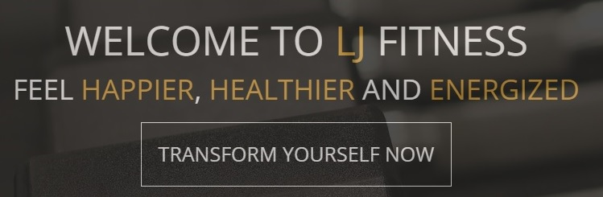

# Portfolio Project 4 - Full Stack Frameworks with Django

## LJ Fitness - Live Site

[View Live Site]()

## Business Objectives

As a gym goer myself, I decided to design and create a website that allows users to access the website in order to locate and purchase the wide range of monthly memberships that the gym has to offer, as well as signing up to create their own account to manage memberships. The site also allows the owner/business to advertise their brand and keep their membership offers up to date.

The primary focus for this website is to provide a database for the user so that they can view and purchase their own chosen memberships with just a few clicks. Users will also be able to add and delete memberships as they please. 
The owner of the site can update and delete memberships too, in order to advertise their current passes available.

The application is designed to be responsive to all screen sizes and accessible to all users, so that navigation is easy for everyone, no matter what device is being used. My goal is to achieve this with a visually appealing, interactive UX, which encourages users to:
- view a wide range of memberships that they are able to purchase in order to join LJ Fitness.
- purchase as many monthly memberships as they would like.
- create their own account so they can easily view which memberships they are currently signed up to.
- share the website with friends and family to encourage them to sign up.
- follow the company's social media platforms to keep up-to-date with the gym's latest offers and recent activities.
- contact the owner of the site if they wish to.

The owner of the site will be able to:
- inform visitors of new memberships or classes.
- promote the wide range of memberships they have to offer.
- edit or delete memberships.
- communicate with visitors who have reached out via email.

## Homepage Mockup

## User Experience (UX)
### User Stories
**First Time Visitor Goals**

1. As a first time visitor, I want to understand what the site's purpose is so that I know whether or not I want to explore further.

2. As a first time visitor, I want to know as much information as possible about the memberships so I know which is right for me.

3. As a first time visitor, I want to be able to easily register so I can keep track of memberships that I have purchased.

4. As a first time visitor, I would like to be able to contact the owner easily if I have any queries.

**Returning Visitor Goals**

5. As a returning user, I want to be able to purchase my chosen membership/s with just a few clicks.

6. As a returning user, I want to be able to log into my account easily to view and manage my membership/s.

**Frequent Visitor Goals**

7. As a frequent user, I want to be able to follow the company's social media platforms so that I can follow them and share my fitness journey, as well as keeping up-to-date with any new activities or offers.

8. As a frequent user, I want to be able to access and manage my profile and memberships.

**Site Owner Goals**

9. As a site owner, I want to advertise the memberships I have to offer to clients with a clean and organised look.

10. As a site owner, I need to enforce some basic access control when a user is editing or deleting data in order to prevent unauthorised editing or deletion of user uploaded data.

11. As a site owner, I need to provide a safe and secure payment system for my clients.

12. As a site owner, I want to receive email enquiries from clients directly into my inbox.

## Design
### Colour Scheme
Colour contrast checks were made throughout the process of building the project to save going back and re-doing colours that did not work together.

The main colour scheme is clean and sharp, using shades of *dark-grey*, *light-grey*, *off-white* and *orange*. The look and feel I wanted to go for was the same first impression you want when you first walk into a gym - sharp, confident and bold.

There are some photographic images throughout, to tie in well with the theme of the site. These images are used on the landing page, and the *Membership Details* page. The images I chose were selected to inspire potential clients into signing up for the gym.

The text throughout the site is either off-white against the dark-grey background, or orange against a grey background, in order to keep the sharp contrast throughout the site.

### Typography

Fonts are imported into the head of the base.html template via [Google Fonts.](https://fonts.google.com/)

To keep up with the boldness of the site, I chose to use a font that is easy to read, alongside heavy use of uppercase text.
I have chosen to use the font family of 'Open Sans', with a fallback font of 'san-serif', in the event of the preferred font failing to import. This font will hopefully create a positive user experience when first entering the site as it exudes a professional yet bold approach.

### Imagery

Photographic imagery is used in some parts of the site, all images are sourced from [Pixabay](https://pixabay.com/photos/search/) and [Pexels.](https://www.pexels.com/)

The landing page consists of a header, a background image, a welcome message and a footer. The chosen background image was selected because of its subtle tones and lack of contrast against the other elements, as I did not want to distract the site user away from the text.

This image gives the user a good idea of what the site is about upon entering.

The *Membership Details* page contains information and the option to add the selected membership to the users' cart. Alongside the membership information is an image of a lady at the gym, I wanted this to inspire the site user to explore further and motivate them to purchase a membership pass.

## Wireframes
Wireframes for the original design concepts across all devices were created using [Balsamiq.](https://balsamiq.com/wireframes/)

**Landing Page**

The landing page explains the purpose of the site to new and returning users through imagery and subheadings. From here users are able to sign up/in, contact the site owner, view social media platforms and view the available memberships via a link.

**Sign-Up/Sign-In Page**

 Here users can create unique log-in credentials based on an alphanumeric Username and alphanumeric Password. Back-end logic tests for duplicate entries and password confirmation.

**Memberships Page**

Whether a user has signed up or not, they are able to view all memberships that the gym has to offer. Memberships can be filtered down to a specific category, "HIIT Fitness", "Strength & Conditioning", "Boxing" and "View All".

**Membership Details Page**

Here the user is able to view information about the membership as well as being given the option to add the pass to their cart. Upon which they will see a pop up letting them know that they have successfully added the item to their cart. The pop up will contain a button that will direct the user to the checkout page.

**Checkout Page**

Users can view, update and delete their shopping cart contents before they proceed to the payment page.

**Payment Page**

Users are shown a summary of their order details. A form must be filled out containing users' billing details. The user will be given the option to save details in order to make a profile.

**My Memberships Page**

Users are able to view any membership passes that they have previously purchased. Users can view and update their default billing information also. *In the future I would like to add another feature to this page that allows the user to see when their pass expires.*

## Database schema - Database Django

*The database models were created with json fixtures.*

### Categories

1. Strength & Conditioning Sessions

2. HIIT Fitness Sessions

3. Boxing Sessions

### Products/Memberships

1. Bronze

2. Silver

3. Gold

### Products/Memberships - Details

- Sku
- Name
- Description
- Price
- Category

## Apps
1. Milestone_4 -  the project level app.

2. Bag -  the user is able to place products/memberships into their cart.

3. Checkout - the user is able to purchase said products via Stripe.

4. Contact - the user is able to contact the site owner via email.

5. Home - the landing page and anchor point allows users to navigate the site easily.

6. Products - the user is able to browse memberships and the site owner is able to add/update/delete memberships.

7. Profiles - the user can create their own profile and manage their memberships.

## Features
### Existing Features
| Feature | Description | Image URL |
| ------- | ----------- | --------- |
| Landing | Landing page to convey the purpose of the website to new and returning users. | [Landing Page](/documentation/images/features/landing.jpg) |
| Welcome Message | A section on the landing page that welcomes the user to the LJ Fitness website. Contains a button that directs user to the Memberships page. | [Welcome](/documentation/images/features/welcome-text.jpg) |
| Header | Logo, nav bar and shopping cart allow users to navigate through the site with ease. Burger icon displays on smaller devices. | [Header](/documentation/images/features/header.jpg) |
| Footer | Gym timetable is displayed and social media icons direct the user to the company's social media platforms. | [Footer](/documentation/images/features/footer.jpg) |
| Sign Up | Provides the opportunity for new users to sign-up quickly and efficiently. | [Sign Up Form](/documentation/images/features/sign-up.jpg) |
| Sign In | Provides the opportunity for returning users to log-in quickly. | [Sign In Form](/documentation/images/features/sign-in.jpg) |
| Password Reset | Allows users to reset their password in the event of a forgotten password. | [Password Reset Page](/documentation/images/features/password-reset.jpg) |
| Memberships | Displays all memberships that the gym has to offer. These can be filtered by category via the nav bar by selecting 'Memberships' and clicking on their chosen category. Users can click the 'Join Now' button to view full details with an option to add to cart. | [Memberships Page](/documentation/images/features/memberships.jpg) |
| Membership Details | Full details about the selected membership is displayed. Users are given the option to add this item to their cart via the 'Add To Cart' button, as well as increasing the quantity of the item. | [Membership Details Page](/documentation/images/features/membership-details.jpg) |
| Toasts | Toast messages let users know of their successes and failures throughout the site when performing certain actions. | [Succesfully Added To Cart Toast](/documentation/images/features/toasts.jpg) |
| Shopping Cart | Users can view their shopping cart which consists of the items added and the grand total price. Users are given the opportunity to increase the quantity, continue shopping or to purchase their items securely. | [Shopping Cart Page](/documentation/images/features/shopping-cart.jpg) |
| Checkout | A form that allows users to enter their billing details in order to purchase their items securely. Users are given the opportunity to create an account/profile upon completing the form which is saved to the database. | [Checkout Form1](/documentation/images/features/checkout1.jpg) [Checkout Form2](/documentation/images/features/checkout2.jpg) |
| My Memberships (CRUD) | Displays order history to users and allows users to update billing details. | [My Memberships Page](/documentation/images/features/my-memberships.jpg) |
| Add Membership (CRUD) | Admin access only. A form that allows superusers and site owners to add a new product/membership which will be added to the database and displayed on the Memberships page. | [Add Membership Form](/documentation/images/features/add-membership.jpg) |
| Edit Membership (CRUD) | Admin access only. A form that allows superusers and site owners to edit a product/membership which will be updated in the database and displayed on the Memberships page. | [Edit Membership Form](/documentation/images/features/edit-membership.jpg) |
| Contact Form | A form that allows users to contact the site owners via email. *The form is not set up to send out real emails but set so that they will be logged in the terminal.* | [Contact Form](/documentation/images/features/contact-form.jpg) |

### Security Features

| Feature | Description |
| ------- | ----------- |
| User Log-In | A simple username and password is required for registration. |
| Session Cookie | Upon registering or logging in, a unique session cookie is generated for the duration of the users' session. |
| Restricted Access | Users cannot edit or delete products/memberships. Only admin users can manage products.

### Features yet to implement

| Feature | Description |
| ------- | ----------- |
| Interactive Timetable | At the moment, the timetable is static and sits in the footer element. I would like to implement an interactive timetable that allows users to select a day and time that they can book onto. |
| Membership Expiry Date | With each membership being available for 1 month, an expiry date that lets the user know when they can use their membership until would be useful. I would like to learn the functionality that would calculate when the expiry date would be and sends the user a reminder via email when that date is approaching. Viewing the expiry date in the 'My Memberships' page would also be beneficial. |
| Live Emails | Setting up an email system for the contact form. |
| Live Stripe Payments | If the site were to go live, a fully functional payment system would be beneficial. |
| 1 Month Free Trial | Giving the user a month's free trial before signing up. I would need to learn the functionality for this so that the date of the user signing up for a trial calculates when their trial would expire and their payment begins. |
| Membership Subscriptions | Users would have a rolling payment set up that allowed them to have a fully functional subscription so that they did not have to purchase a new membership each month. |

## Technologies Used
### Languages
- HTML5
- CSS3
- Python
- JavaScript

### Libraries/Integrations/Frameworks

- Django

- jQuery

- Jinja

- Bootstrap

- Hover.css

- Google Fonts

- Font Awesome

- Balsamiq

### Database Management System

- Django Database

### Version Control, Storage & Hosting

- Chrome Dev Tools

- Github

- Git

- Gitpod

- Heroku

- Stripe

- Multi Device Mockup Generator (techsini) - [TechSini.com](http://techsini.com/multi-mockup/index.php)

- WebAIM Contrast Checker

- W3C Markup Validator

- W3C CSS Validator

- JShint

- PEP8 Validator

## Testing

All testing for this project can be found in the [TESTING.md file](TESTING.md).

## Deployment

This project was created using Gitpod, which enabled me to stage and commit the files via Git (version control). All of the files necessary to run this website have been stored in a GitHub repository. The site was deployed using Heroku *(see below*).

### Forking the GitHub repository

1. Select the repository you wish to fork.
2. In the top right corner of the page (under your account icon) there will be an option to Fork.
3. By selecting Fork you will now have a copy of the respository in your own Github account.

### Cloning the Github Repository:

1. Select the repository you wish to clone locally.
2. Above the files, locate the Code dropdown menu.
3. Select and copy the link appropriately (HTTPS, SSH, Github CLI).
4. Open the terminal and change the directory to where you want the cloned version to be located.
5. Type git clone and paste the copied link.
6. Press Enter to create local clone.

### Creating the Heroku App

As this is a full-stack website it has been deployed to Heroku.com using the following procedure:

1. Register/log-in to Heroku.
2. From the Dashboard, select the "New" button on the top-Right of the screen, then select "Create new app".
3. Choose your app name.
4. Select your region.
5. Click "Create App".

### Heroku Deployment

1. In the "Deployment Method" section, select Github. Locate the Connect to GitHub section below.
2. Your Github profile should be displayed, if not type in your GitHub username.
3. Select the corresponding repository, and click "Connect".

Configuration settings and secret keys are needed for this app, which Heroku requires in order for the website to function as desired. To do this you need to set the Config Vars within Heroku:

5. Under the "Settings" tab, in the Config Vars section select the "Reveal Config Vars" button.
6. This will reveal a form for inputting the key and value pairs necessary to connect to the app, as follows:

| KEY | VALUE |
| --- | ----- |
| IP | 0.0.0.0 |
| PORT | 5000 |
| SECRET KEY | Randomly Generated Fort Knox Key |
| MONGO_URI | Your unique MongoDB URI |
| MONGO_DBNAME | Your unique Mongo DB name |

You can find the above Mongo_URI value in the appropriate Mongo DB Project under Cluster by selecting "Connect".

7. Select "Clusters".
8. Select "Connect".
9. Select "Connect your application".
10. Choose your Driver and Version.
11. Copy your connection string.

***Remember to substitute in your own DBNAME and Password***

### Enabling Automatic Deployment

1. In Heroku, click the "Deploy" tab.
2. In the "Automatic deploys" section select the branch you wish to use.

***Since first deploying the application on Heroku, Heroku themselves have encountered a security problem and therefore have had to remove certain functionalities that would allow users to automatically deploy or update. All deployments are now carried out manually using the following procudure:***

1. In the terminal, run the command `heroku login -i` and login when prompted.
2. Run the following command: `heroku git:remote -a your_app_name_here` and replace `your_app_name_here` with the name of your Heroku app. This will link the app to your Gitpod terminal, and the Heroku app to the Gitpod workspace.
3. After linking your app to your workspace with one of the above steps, you can then deploy new versions of the app by running the command `git push heroku main` and the app will be deployed to Heroku.

## Credits

The content of this website was created by Laura Jones. Snippets of code have been copied from official documentation and other sources credited below. All pre-loaded recipes were taken from various Cookbooks and online recipe sites, which are also credited below.

### Code

Much of the structure of this site follows what was taught during the Backend Development - Task Manager walkthrough project provided by Code Institute, but has been modified to suit a recipe database site.

| Code Snippet | Description | Source |
| ------------- | ----------- | ------ |
| Navbar |  Navbar element sits on the right with a responsive burger icon on smaller devices | [Materalizecss.com](https://materializecss.com/navbar.html) |
| Footer | Footer content is spaced evenly using rows and columns, consisting of a *Sign-Up* section and social media links | [Materalizecss.com](https://materializecss.com/footer.html) |
| Forms | Rows and colums are used to make the forms look organised and evenly spaced (Register, Log-In, Add/Edit Recipe and Add/Edit Categories) | [Materlizecss.com](https://materializecss.com/text-inputs.html) |
| Cards | Cards are used in the Profile page (welcomes user), the Recipes page (each card stands for a different diet category and holds the relevant recipes), the Search bar and in the Manage Categories page | [Materializecss.com](https://materializecss.com/cards.html) |
| Collapsible Recipes | Recipes drop down when they are clicked to keep the page looking organised | [Materializecss.com](https://materializecss.com/collapsible.html) |
| Buttons | Buttons used throughout the site | [Materliazecss.com](https://materializecss.com/buttons.html) |
| Python functions | The backend functionality structure was taught via the Code Institute Task Manager Project | [CI Task Manager Walkthrough Project](https://learn.codeinstitute.net/courses/course-v1:CodeInstitute+DCP101+2017_T3/courseware/9e2f12f5584e48acb3c29e9b0d7cc4fe/054c3813e82e4195b5a4d8cd8a99ebaa/) |
| Form Validation for Dropdown Input Box | Ensures form validation on the dropdown input field when using Materliaze | [CI Task Manager Walkthrough Project](https://learn.codeinstitute.net/courses/course-v1:CodeInstitute+DCP101+2017_T3/courseware/9e2f12f5584e48acb3c29e9b0d7cc4fe/6449dcd23ca14016aa83dc7313d91a02/?child=first) |
| 404 Page | Renders 404 Page through Python & Flask | [GeeksForGeeks.org](https://www.geeksforgeeks.org/python-404-error-handling-in-flask/) |

| Imagery | Description | Source |
| ------------- | ----------- | ------ |
| Landing Page | Background Image | [Pixabay](https://pixabay.com/) |
| Recipes Page | Card Images | [Pixabay](https://pixabay.com/) |
| Manage Categories | Card Images | [Pixabay](https://pixabay.com/) |

## Acknowledgements

- Code Institute - for the video tutorials and providing the knowledge for Python, Flask and some of the different databases structures.

- Code Institute Tutors - Providing advice on how to run a loop more than once on the same page.

- Code Institute Mentor, Spencer Barriball - for the fantastic, professional advice on what makes a good web developer.

- Fellow Slack Members - for providing outstanding advice in times of need.